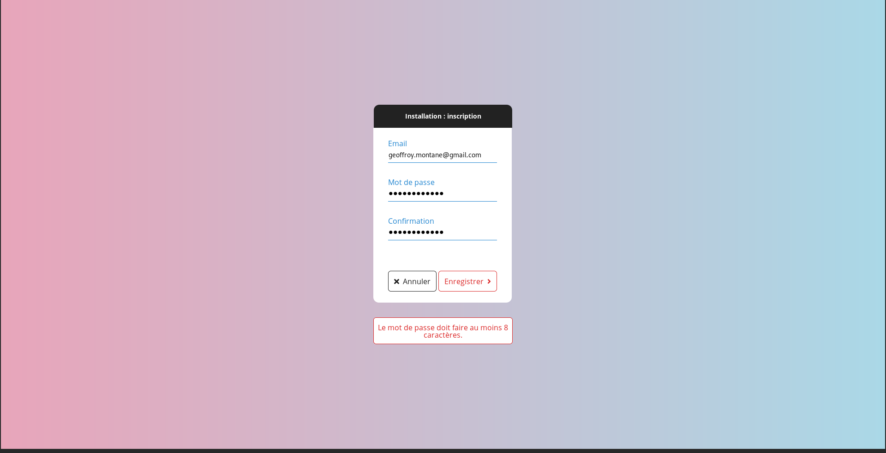
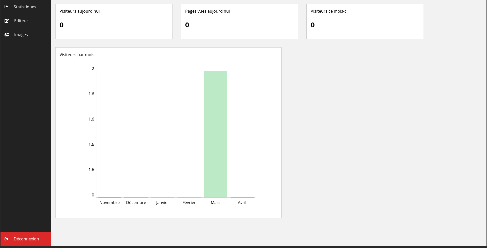
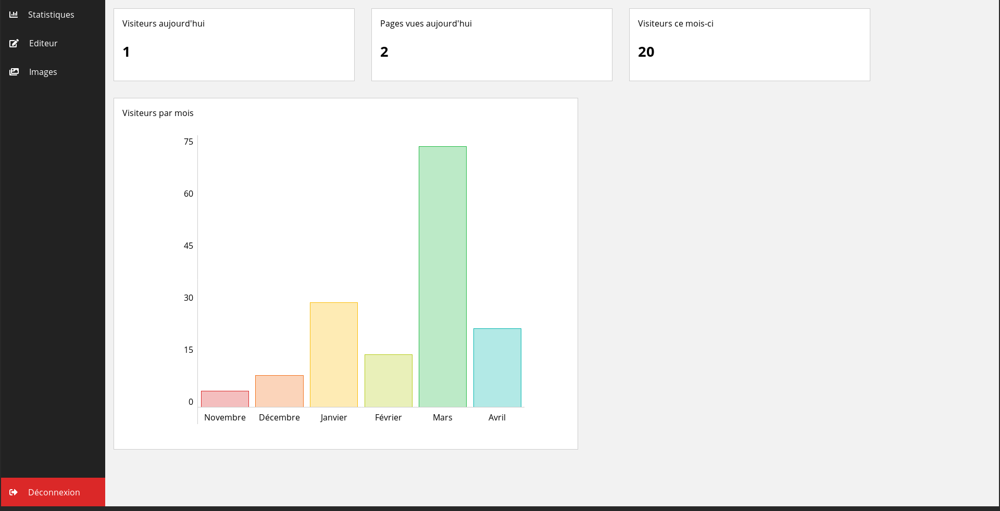

# lightCMS

## Installation

Il convient d'installer un serveur **Apache** ainsi que **MariaDB** ou MySQL sur une machine. Par la suite, s'assurer que php est bien installé et correctement configuré avec le serveur apache (notamment vérifier que le driver mysql est bien activé dans le php.ini). Enfin, cloner ce dépôt à la racine web du serveur apache et visiter l'url /lightCMS. L'installateur web prend alors le relais.

Si d'aventure l'installateur web précise qu'il ne peut créer le fichier de configuration, effectuer des chmod 777 sur les fichiers lightCMS et install.

L'intégralité de ces étapes devraient être inutiles sur un serveur web préconfiguré doté d'un accès ftp. Dans ce cas, il suffit de placer le répertoire lightCMS à la racine web (www ou / en général) et de visituer l'url /lightCMS.

**ATTENTION** : en l'absence de certificat ssl (https), vos mots de passe sont susceptibles d'être exposés. Par conséquent, ne pas employer de mots de passe que vous utilisez par ailleurs.

## To-do

*  Bug images alignées à gauche/droite
*  Ajouter l'option souligner
*  Comment aligner deux images horizontalement ?
*  Vérification de la qualité du mot de passe

## Screenshots

  
  
  
  
  

